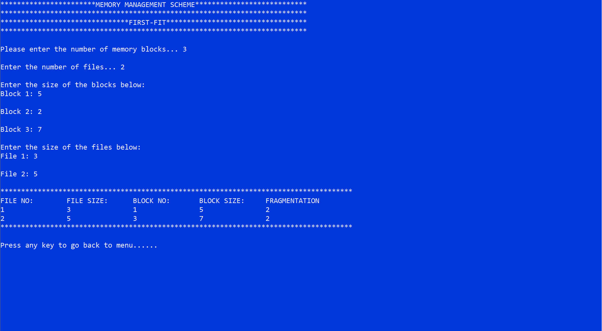

# COSC225_Operating-Systems
 Group assignments for Operating systems

___

## GROUP MEMBERS 

1. 219CS01000078     **Blege Bright Edem**
1. 219CS01000037     **Mensah Bernard**
1. 219EI01000036     **Kodom Stephen**

___

~~~
The program are numerical input function for menu selection.
Switch statements are used for the decision-making process
Below are the codes for that
~~~

~~~c++
      // Displays a message

        cout <<"***********************MEMORY MANAGEMENT SCHEME***************************";
        cout <<"\n**************************************************************************";
        cout <<"\n*******************************PAGING TECHNIQUE**********************************";
        cout <<"\n**************************************************************************";

    cout <<"\nPlease enter the memory size-- ";
    cin >> memSize;

    cout << "\nEnter the page size-- ";
    cin >> pageSize;

    numPages = memSize/pageSize;

    cout << "\nThe number of pages available in memory are -- "<<numPages;

    cout << "\nEnter number of processes-- ";
    cin >> numProcess;

    remPages = numPages;

    for(i=1;i<=numProcess;i++){
        cout << "\nEnter number of pages required for p["<<i<<"] -- ";
        cin >> s[i];

        if(s[i]>remPages){
            cout << "\nMEMORY FULL!!";
            break;
        }
        remPages = remPages - s[i];
        cout << "\nEnter page table for p["<<i<<"] -- ";
        for(j=0;j<s[i];j++){
            cin >> fno[i][j];
        }
    }

    cout <<"\nEnter Logical Address to find Physical Address";
    cout << "\nEnter process number , Page number and Offset(Eg. 3  6  54) -- ";
    cin >> x >> y >> offset;
    if(x>numProcess || y>s[i] || offset>=pageSize){
        cout << "\nINVALID PROCESS OR PAGE NUMBER OR OFFSET";
    }else{
        pa = fno[x][y]*pageSize+offset;
        cout <<"\nThe Physical Address is -- "<<pa;
    }
    cout <<"\n*************************************************************************************";
    cout << "\n\nPress any key to go back to menu...... ";
    getch();
    system("cls");
menu();
~~~
___
~~~
The program does not close till the user intend to do so

~~~

## A typical example for the method operation is the First-fit method below

~~~c++
// First-Fit function processing
void firstFit(){
    // Maximum fragmentation size
    const int max = 25;

    // All the variables used in the method declaration
    int frag[max],blockSize[max],fileSize[max],i,j,numBlocks,numFiles,temp;

         static int bf[max],ff[max];

        // Clears the console screen
        system("cls");

        // Displays a message
        cout <<"***********************MEMORY MANAGEMENT SCHEME***************************";
        cout <<"\n**************************************************************************";
        cout <<"\n*******************************FIRST-FIT**********************************";
        cout <<"\n**************************************************************************";

        // Requesting and getting input
        cout << "\n\nPlease enter the number of memory blocks... ";
        cin >> numBlocks;
        cout << "\nEnter the number of files... ";
        cin >> numFiles;

        //Prompt for entering size of each block
        cout << "\nEnter the size of the blocks below:";

        // Loops through each block to receive its size
        for(i=1;i<=numBlocks;i++){
            cout <<"\nBlock "<<i<<": ";
            cin >> blockSize[i];
        }

        cout << "\nEnter the size of the files below:";

        // Loops through each file to receive its size
        for(i=1;i<=numFiles;i++){
            cout <<"\nFile "<<i<<": ";
            cin >> fileSize[i];
        }

        for(i=1;i<=numFiles;i++){
            for(j=1;j<=numBlocks;j++){
                if(bf[j]!=1){
                    temp=blockSize[j]-fileSize[i];
                    if(temp>=0){
                        ff[i]=j;
                         break;
                    }
                }
            }

            frag[i]=temp;
            bf[ff[i]]=1;
        }

    cout <<"\n*************************************************************************************";
    cout << "\nFILE NO:\tFILE SIZE:\tBLOCK NO:\tBLOCK SIZE:\tFRAGMENTATION";
    for(i=1;i<=numFiles;i++){
         cout <<"\n"<<i<<"\t\t"<<fileSize[i]<<"\t\t"<<ff[i]<<"\t\t"<<blockSize[ff[i]]<<"\t\t"<<frag[i];
    }

    cout <<"\n*************************************************************************************";
    cout << "\n\nPress any key to go back to menu...... ";
    getch();
    system("cls");
menu();
}
~~~

*This is how the interface for the first-fit looks like*

## All other functions are structured like the one above 
