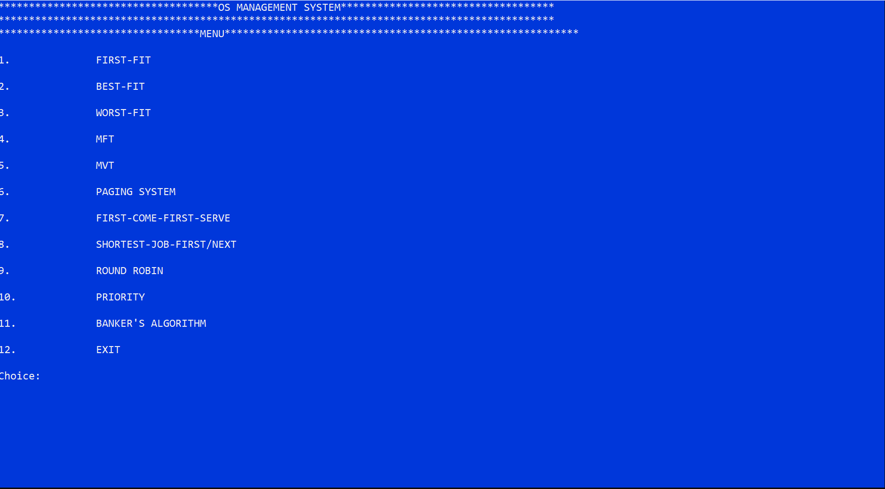

# COSC225_Operating-Systems
 Group assignments for Operating systems

___

## GROUP MEMBERS 

1. 219CS01000078     **Blege Bright Edem**
1. 219CS01000037     **Mensah Bernard**
1. 219EI01000036     **Kodom Stephen**

___

## MANAGEMENT SYSTEM(I.E MEMORY, PROCESS ETC)
This program was built in c++ and is a menu-driven application.
The input required are numerical values to select an option to operate.

___

All options are programmed in methods that are embedded in the same class and called each type through a key input

See the README in the *Management System-All-in-In* folder for more info about the programming procedure
___
# NOTE
**The application was programmed in CodeBlocks IDE but i have added gitignore so as to be opened in other IDE platforms**

___
__THIS IS A MENU-DRIVEN USER INTERFACE__
~~~
The first screen that appears after you run the program is below:
~~~

_All function declaration in the class are below_

~~~c++
void menu();
void start();
void worstFit();
void bestFit();
void firstFit();
void MFT();
void MVT();
void pagingTechnique();
void firstComeFirstServe();
void shortestJobNext();
void roundRobin();
void priority();
void banker_sAlgorithm();

~~~

As it can be seen we used C++ in our implementation.
Extra information on the various management methods are in the __README file__ in _Management System-All-in-In_ folder
